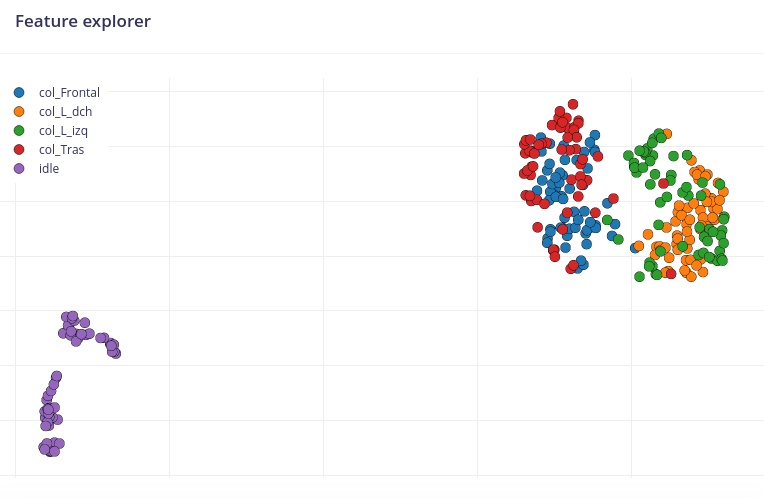

# Base de datos
Este directorio contiene la base de datos exportada de Edge Impulse para que se pueda importar y seguir trabajando desde otros proyectos con los mismos datos

## Features

Los features extraidos mediante edge impulse usando tanto datos en crudo como analisis expectral son los siguietes:

### Analisis Features
Como se puede observar hay dos grandes grupos que separará muy bien, estos grupos son "idle" y el correspondiente a los distintos tipos de colisiones, a parte dentro del grupo al que pertenecen las colisiones se puede ver que estan muy juntas las distntas muestras lo que dificultará en gran medida su clasificación mediante ML.