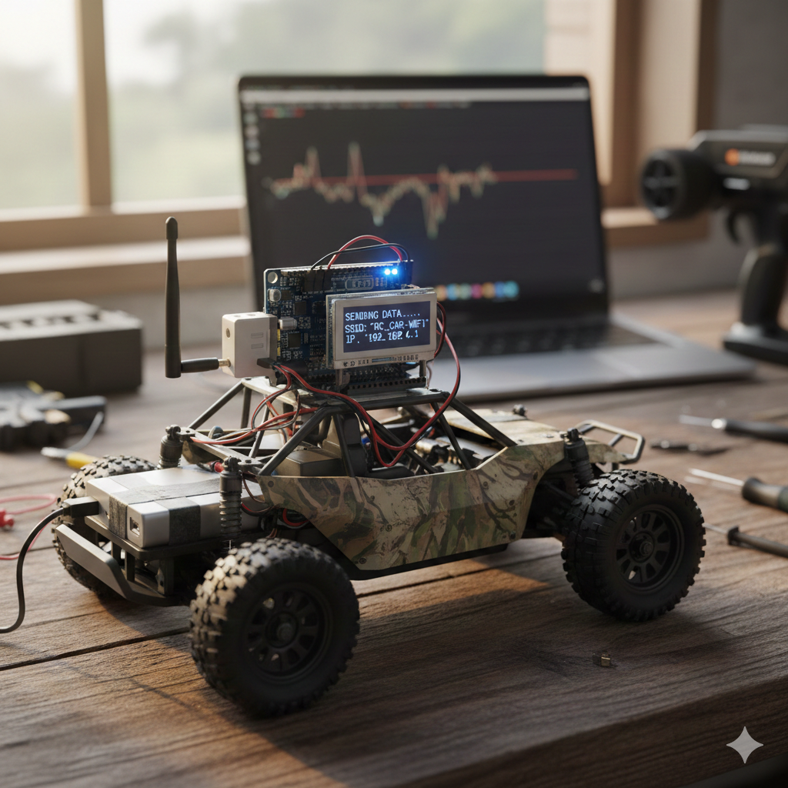

# Trabajo-Final-RSE
En este repositorio se encuentra el código, objetivos y documentación para la realización del trabajo final de la asignatura de redes de sensores electronicos del master en Ingeniería Electrónica impartido por la universidad de Zaragoza.

## Descripcción del Trabajo
El trabajo consta de un coche a radio control sobre el cual se hara detección de eventos usando los acelerometros y giroscopios de una placa Arduino Nano BLE 33

## Objetivos
- Generar una base de datos mediante el uso de acelerometros para la detección de distintos eventos
- Programar un algoritmo capaz de clasificar los eventos que sufra el coche a radio control tomando como entradas los acelerometros y giroscopios de la placa.
- Con el código implementado generar una placa hardware que contenga lo minimo para que este funcione eliminando todo aquello que se considera accesorio del arduino Nano BLE 33

## Papers de referencia
- [Effective Car Collision Detection with Mobile Phone Only](https://www.researchgate.net/publication/352251445_Effective_Car_Collision_Detection_with_Mobile_Phone_Only)
- [Review for Accident Detection and Alerting System](https://www.irjet.net/archives/V11/i4/IRJET-V11I4191.pdf)
- [Real-Time Vehicle Emergency Braking Detection with Moving Average Method Based on Accelerometer and Gyroscope Data](https://www.mdpi.com/2624-8921/7/4/106)
